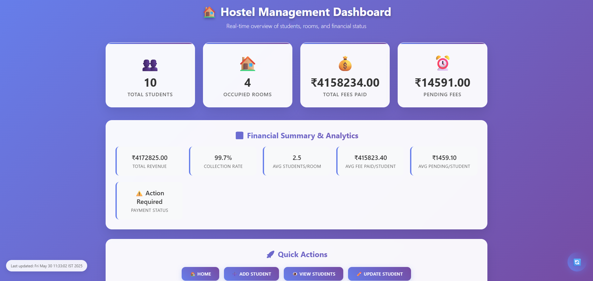
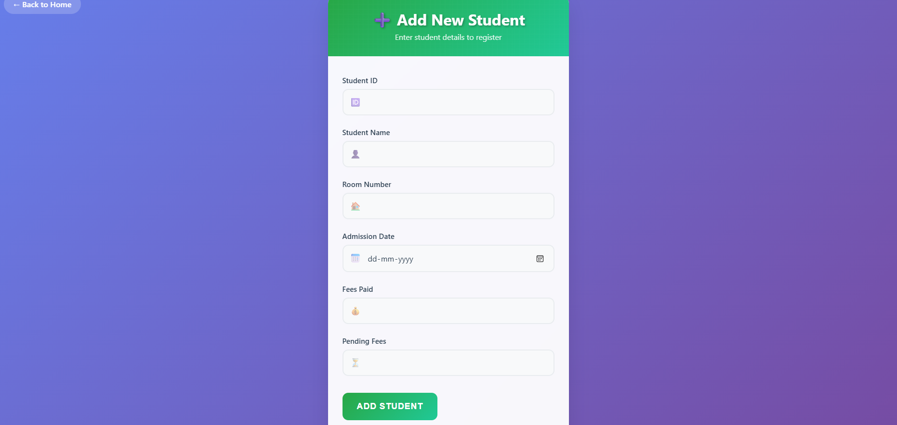
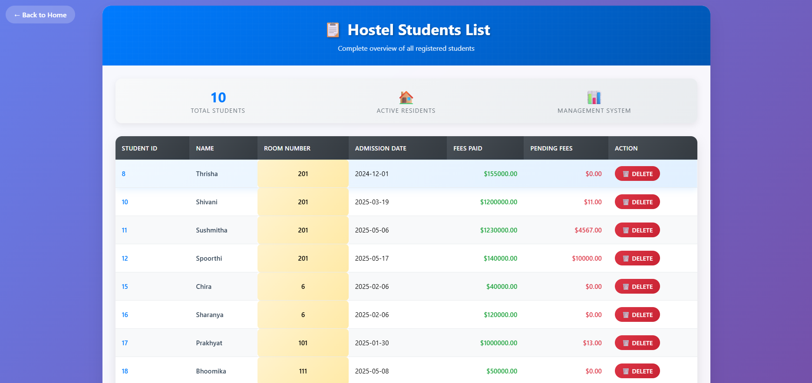
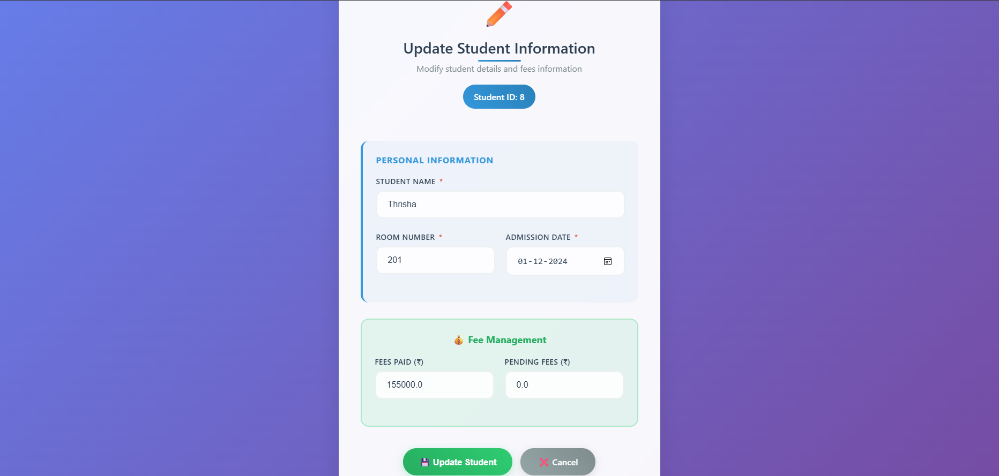
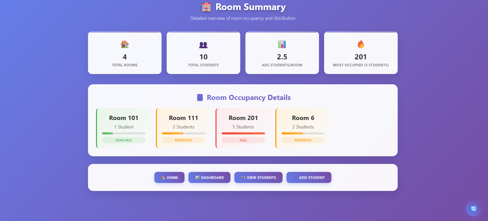

# 🏠 Hostel Management System

**Subject**: Advanced Java (BCS613D)  
**Developer**: Thrisha M S  
**USN**: 4AL22CS180  
**Semester**: VI/C

A comprehensive web application for managing hostel operations including student accommodation, room allocation, fee management, and facility tracking built with JSP, Servlets, and MySQL following MVC architecture principles.

## 📋 Table of Contents
- [Features](#-features)
- [Technology Stack](#-technology-stack)
- [Prerequisites](#-prerequisites)
- [Installation & Setup](#️-installation--setup)
- [Project Structure](#️-project-structure)
- [Database Setup](#️-database-setup)
- [Configuration](#-configuration)
- [Usage Guide](#-usage-guide)
- [API Endpoints](#-api-endpoints)
- [Screenshots](#-screenshots)
- [Security Features](#-security-features)
- [Troubleshooting](#-troubleshooting)
- [Contributing](#-contributing)
- [License](#-license)

## 🚀 Features

### Core Modules
- **👥 Student Management**: Complete CRUD operations for student records and registrations
- **🏠 Room Allocation**: Automated room assignment with occupancy tracking
- **🏢 Hostel Administration**: Manage multiple hostels, blocks, and room types
- **💰 Fee Management**: Hostel fee calculation, payment tracking, and receipt generation
- **🍽️ Mess Management**: Meal planning, menu management, and mess fee calculation
- **👁️ Visitor Management**: Track visitor entries and security management
- **🔧 Maintenance Requests**: Handle room and facility maintenance issues
- **📊 Advanced Reports**: Generate comprehensive reports for administration
- **📢 Notice Board**: Digital notice system for announcements
- **📝 Complaint Management**: Handle student complaints and grievances

### Advanced Features
- **🔍 Advanced Search**: Search students by ID, name, room number, or block
- **📈 Analytics Dashboard**: Real-time occupancy and financial analytics
- **🔐 Role-based Access**: Different access levels for wardens, staff, and students
- **📱 Responsive Design**: Bootstrap-based mobile-friendly interface
- **✅ Input Validation**: Client-side and server-side validation
- **🔄 Real-time Updates**: Live occupancy status and availability tracking

## 💻 Technology Stack

### Backend
- **Java 8+**: Core programming language
- **JSP (JavaServer Pages)**: Dynamic web page generation
- **Servlets**: Server-side request handling
- **JDBC**: Database connectivity
- **MySQL**: Relational database management

### Frontend
- **HTML5**: Markup language
- **CSS3**: Styling and layout
- **JavaScript**: Client-side scripting
- **Bootstrap 4.5**: Responsive UI framework
- **jQuery**: JavaScript library for DOM manipulation

### Server & Tools
- **Apache Tomcat 9.0+**: Web application server
- **Eclipse IDE**: Development environment
- **XAMPP**: Local development stack
- **Git**: Version control system

## 📋 Prerequisites

Before running this application, ensure you have:

### Required Software
- ☑️ **Java Development Kit (JDK) 8 or higher**
- ☑️ **Apache Tomcat 9.0 or higher**
- ☑️ **MySQL Server 5.7+ or XAMPP Server**
- ☑️ **MySQL JDBC Driver (mysql-connector-java)**
- ☑️ **IDE**: Eclipse (J2EE), IntelliJ IDEA, or VS Code
- ☑️ **Web Browser**: Chrome, Firefox, Safari, or Edge

### System Requirements
- **RAM**: Minimum 4GB (8GB recommended)
- **Storage**: At least 2GB free space
- **OS**: Windows 10/11, macOS 10.14+, or Linux Ubuntu 18.04+

## ⚙️ Installation & Setup

### Step 1: Clone the Repository
```bash
git clone https://github.com/samayshetty/hostel-management-system.git
cd hostel-management-system
```

### Step 2: Database Setup
1. **Start MySQL Server**
   ```bash
   # Using XAMPP
   Start XAMPP Control Panel → Start MySQL
   
   # Using MySQL Service
   sudo systemctl start mysql  # Linux
   brew services start mysql   # macOS
   ```

2. **Create Database**
   ```sql
   CREATE DATABASE IF NOT EXISTS hostel_management;
   USE hostel_management;
   ```

3. **Run Database Scripts**
   - Execute the SQL scripts from `database/schema.sql`
   - Insert sample data using `database/sample_data.sql`

### Step 3: Configure Database Connection
Update `src/com/dao/DatabaseUtil.java`:
```java
private static final String URL = "jdbc:mysql://localhost:3306/hostel_management";
private static final String USERNAME = "your_mysql_username";
private static final String PASSWORD = "your_mysql_password";
```

### Step 4: Add MySQL JDBC Driver
1. Download MySQL Connector/J from [MySQL Official Site](https://dev.mysql.com/downloads/connector/j/)
2. Copy `mysql-connector-java-x.x.x.jar` to `WEB-INF/lib/` directory
3. Add to IDE build path if necessary

### Step 5: Deploy to Tomcat
1. **Using Eclipse IDE:**
   - Right-click project → Export → WAR file
   - Deploy WAR to Tomcat webapps directory
   
2. **Manual Deployment:**
   ```bash
   cp HostelManagementSystem.war $TOMCAT_HOME/webapps/
   ```

### Step 6: Start Application
1. Start Tomcat server
2. Access application at: `http://localhost:8080/HostelManagementSystem/`

## 🗂️ Project Structure

```
HostelManagementSystem/
├── 📁 src/
│   ├── 📁 com/
│   │   ├── 📁 dao/                    # Data Access Objects
│   │   │   ├── DatabaseUtil.java      # Database connection utility
│   │   │   ├── HostelDAO.java         # Hostel data operations
│   │   │   ├── StudentDAO.java        # Student data operations
│   │   │   ├── RoomDAO.java           # Room management operations
│   │   │   └── FeeDAO.java            # Fee management operations
│   │   ├── 📁 model/                  # Data Models/POJOs
│   │   │   ├── Student.java           # Student entity
│   │   │   ├── Hostel.java            # Hostel entity
│   │   │   ├── Room.java              # Room entity
│   │   │   └── Fee.java               # Fee entity
│   │   └── 📁 servlet/                # Servlet Controllers
│   │       ├── AddStudentServlet.java
│   │       ├── DisplayStudentsServlet.java
│   │       ├── UpdateStudentServlet.java
│   │       ├── DeleteStudentServlet.java
│   │       ├── RoomSearchServlet.java
│   │       └── DashboardServlet.java
├── 📁 src/main/webapp/               # Web Resources
│   ├── 📁 WEB-INF/
│   │   ├── web.xml                   # Deployment descriptor
│   │   └── 📁 lib/                   # JAR libraries
│   ├── 📁 css/                       # Stylesheets
│   │   ├── style.css                 # Main stylesheet
│   │   └── dashboard.css             # Dashboard styles
│   ├── 📁 js/                        # JavaScript files
│   │   ├── main.js                   # Main JS functions
│   │   └── validation.js             # Form validation
│   ├── 📁 images/                    # Image resources
│   ├── index.jsp                     # Home page
│   ├── dashboard.jsp                 # Admin dashboard
│   ├── studentadd.jsp               # Add student form
│   ├── studentdisplay.jsp           # Display students
│   ├── studentupdate.jsp            # Update student
│   ├── studentupdateform.jsp        # Update form
│   ├── room.jsp                     # Room management
│   ├── search_by_room.jsp           # Room search
│   ├── room_summary.jsp             # Room summary
│   ├── pendingfeesreport.jsp        # Fee reports
│   ├── date_range_form.jsp          # Date range selector
│   └── delete_form.jsp              # Delete confirmation
├── 📁 database/                      # Database scripts
│   ├── schema.sql                    # Database schema
│   ├── sample_data.sql               # Sample data
│   └── procedures.sql                # Stored procedures
├── 📁 docs/                          # Documentation
│   ├── API_Documentation.md
│   ├── User_Manual.pdf
│   └── 📁 screenshots/               # Application screenshots
├── 📁 tests/                         # Test files
├── README.md                         # This file
├── LICENSE                           # License information
└── .gitignore                        # Git ignore rules
```

## 🗄️ Database Setup

### Quick Setup Script
```sql
-- Create Database
CREATE DATABASE IF NOT EXISTS hostel_management;
USE hostel_management;

-- Create Tables (Run the complete schema from database/schema.sql)

-- Key Tables:
-- ├── hostels (hostel information)
-- ├── blocks (hostel blocks)
-- ├── rooms (room details)
-- ├── students (student records)
-- ├── room_allocations (room assignments)
-- ├── fee_structure (fee configuration)
-- ├── fee_payments (payment records)
-- ├── mess_menu (meal planning)
-- ├── visitors (visitor management)
-- ├── maintenance_requests (maintenance tracking)
-- ├── complaints (complaint management)
-- └── notices (notice board)
```

### Sample Data
The system comes with pre-loaded sample data including:
- 3 sample hostels (Himalaya, Ganga, Kaveri)
- 5 sample students with allocations
- Room configurations and fee structures
- Sample notices and maintenance requests

## 🔧 Configuration

### Application Properties
Create `src/config.properties`:
```properties
# Database Configuration
db.url=jdbc:mysql://localhost:3306/hostel_management
db.username=root
db.password=your_password
db.driver=com.mysql.cj.jdbc.Driver

# Application Settings
app.name=Hostel Management System
app.version=1.0
app.author=Samay Shetty

# File Upload Settings
upload.max.size=10485760
upload.allowed.types=pdf,jpg,jpeg,png,doc,docx

# Session Configuration
session.timeout=30
```

### Web.xml Configuration
```xml
<?xml version="1.0" encoding="UTF-8"?>
<web-app xmlns="http://xmlns.jcp.org/xml/ns/javaee"
         xmlns:xsi="http://www.w3.org/2001/XMLSchema-instance"
         xsi:schemaLocation="http://xmlns.jcp.org/xml/ns/javaee 
         http://xmlns.jcp.org/xml/ns/javaee/web-app_4_0.xsd"
         version="4.0">
  
  <display-name>Hostel Management System</display-name>
  
  <welcome-file-list>
    <welcome-file>index.jsp</welcome-file>
  </welcome-file-list>
  
  <!-- Servlet Mappings -->
  <servlet>
    <servlet-name>AddStudentServlet</servlet-name>
    <servlet-class>com.servlet.AddStudentServlet</servlet-class>
  </servlet>
  <servlet-mapping>
    <servlet-name>AddStudentServlet</servlet-name>
    <url-pattern>/AddStudentServlet</url-pattern>
  </servlet-mapping>
  
  <!-- Session Configuration -->
  <session-config>
    <session-timeout>30</session-timeout>
  </session-config>
  
</web-app>
```

## 📖 Usage Guide

### 1. Admin Dashboard
- Access comprehensive overview of hostel operations
- View occupancy statistics and financial summaries
- Quick access to all management modules

### 2. Student Management
```
Add Student → Fill Registration Form → Assign Room → Generate ID Card
Update Student → Search Student → Modify Details → Save Changes
View Students → Filter/Search → Export Reports
```

### 3. Room Allocation Process
```
Check Availability → Select Room Type → Auto-assign Room → 
Collect Security Deposit → Generate Allocation Receipt
```

### 4. Fee Management Workflow
```
Configure Fee Structure → Calculate Monthly Fees → 
Process Payments → Generate Receipts → Track Outstanding
```

### 5. Maintenance System
```
Submit Request → Assign Priority → Allocate Technician → 
Track Progress → Complete Work → Update Status
```

## 🔌 API Endpoints

### Student Management
- `POST /AddStudentServlet` - Add new student
- `GET /DisplayStudentsServlet` - Display all students
- `POST /UpdateStudentServlet` - Update student details
- `POST /DeleteStudentServlet` - Delete student record
- `GET /GetStudentServlet?id={studentId}` - Get student by ID

### Room Management
- `GET /RoomSearchServlet` - Search available rooms
- `GET /RoomSummaryServlet` - Get room occupancy summary
- `POST /RoomAllocationServlet` - Allocate room to student

### Fee Management
- `GET /PendingFeesReportServlet` - Get pending fees report
- `POST /FeePaymentServlet` - Process fee payment
- `GET /FeeReceiptServlet?id={receiptId}` - Generate fee receipt

### Dashboard & Reports
- `GET /DashboardServlet` - Load dashboard data
- `GET /ReportServlet?type={reportType}` - Generate various reports

## 📱 Screenshots

### Dashboard Overview

*Main dashboard with key metrics and quick access menu*

### Student Registration

*Comprehensive student registration form with validation*

### Student List

*Display the list of the registered student*

### Updating Student List

*Updating the details of the students*

### Room Management

*Room allocation and occupancy tracking interface*

### Room Searching

*Searching based on the room Number*

## 🔐 Security Features

### Access Control
- **Role-based Authentication**: Separate access for Admin, Warden, and Students
- **Session Management**: Secure session handling with timeout
- **Input Validation**: XSS and SQL injection prevention

### Data Security
- **Password Encryption**: SHA-256 hashing for passwords
- **Data Sanitization**: Input sanitization for all forms
- **Audit Trail**: Complete logging of all transactions

### Security Headers
```java
// Implemented in all servlets
response.setHeader("X-Content-Type-Options", "nosniff");
response.setHeader("X-Frame-Options", "DENY");
response.setHeader("X-XSS-Protection", "1; mode=block");
```

## 🔧 Troubleshooting

### Common Issues & Solutions

#### 1. Database Connection Error
```
Error: Unable to connect to database
Solution: 
- Check MySQL service is running
- Verify database credentials in DatabaseUtil.java
- Ensure MySQL JDBC driver is in classpath
```

#### 2. Tomcat Deployment Issues
```
Error: 404 - Application not found
Solution:
- Check WAR file is properly deployed
- Verify context path in server configuration
- Ensure all dependencies are in WEB-INF/lib
```

#### 3. JSP Compilation Errors
```
Error: Unable to compile class for JSP
Solution:
- Check Java version compatibility
- Verify servlet-api.jar is in classpath
- Clear Tomcat work directory
```

#### 4. Memory Issues
```
Error: OutOfMemoryError
Solution:
- Increase JVM heap size: -Xmx2048m
- Optimize database queries
- Implement pagination for large datasets
```

### Debug Mode
Enable debugging by adding to web.xml:
```xml
<context-param>
    <param-name>debug</param-name>
    <param-value>true</param-value>
</context-param>
```

## 🤝 Contributing

We welcome contributions to improve the Hostel Management System!

### How to Contribute
1. **Fork the repository**
2. **Create a feature branch**
   ```bash
   git checkout -b feature/amazing-feature
   ```
3. **Make your changes**
4. **Add tests** (if applicable)
5. **Commit your changes**
   ```bash
   git commit -m 'Add amazing feature'
   ```
6. **Push to the branch**
   ```bash
   git push origin feature/amazing-feature
   ```
7. **Open a Pull Request**

### Development Guidelines
- Follow Java naming conventions
- Write clean, documented code
- Include unit tests for new features
- Update documentation as needed
- Test on multiple browsers

### Code Style
- Use 4 spaces for indentation
- Maximum line length: 120 characters
- Always use braces for control structures
- Include Javadoc for public methods

## 📄 License

This project is licensed under the MIT License - see the [LICENSE](LICENSE) file for details.

```
MIT License

Copyright (c) 2024 Samay Shetty

Permission is hereby granted, free of charge, to any person obtaining a copy
of this software and associated documentation files (the "Software"), to deal
in the Software without restriction, including without limitation the rights
to use, copy, modify, merge, publish, distribute, sublicense, and/or sell
copies of the Software, and to permit persons to whom the Software is
furnished to do so, subject to the following conditions:

The above copyright notice and this permission notice shall be included in all
copies or substantial portions of the Software.

THE SOFTWARE IS PROVIDED "AS IS", WITHOUT WARRANTY OF ANY KIND, EXPRESS OR
IMPLIED, INCLUDING BUT NOT LIMITED TO THE WARRANTIES OF MERCHANTABILITY,
FITNESS FOR A PARTICULAR PURPOSE AND NONINFRINGEMENT. IN NO EVENT SHALL THE
AUTHORS OR COPYRIGHT HOLDERS BE LIABLE FOR ANY CLAIM, DAMAGES OR OTHER
LIABILITY, WHETHER IN AN ACTION OF CONTRACT, TORT OR OTHERWISE, ARISING FROM,
OUT OF OR IN CONNECTION WITH THE SOFTWARE OR THE USE OR OTHER DEALINGS IN THE
SOFTWARE.
```

## 📞 Support & Contact

### Developer Information
- **Name**: Samay Shetty
- **USN**: 4AL22CS143
- **Email**: samay.shetty@student.edu
- **Course**: Computer Science Engineering
- **Institution**: [Your Institution Name]

### Getting Help
- 📧 **Email Support**: Create an issue on GitHub
- 📖 **Documentation**: Check `/docs` folder for detailed guides
- 🐛 **Bug Reports**: Use GitHub Issues with bug template
- 💡 **Feature Requests**: Use GitHub Issues with feature template

### Acknowledgments
- Thanks to the Advanced Java course instructors
- Bootstrap team for the responsive framework
- MySQL team for the robust database system
- Apache Tomcat community for the web server

---

**⭐ If you find this project helpful, please give it a star on GitHub!**

**📅 Last Updated**: May 30, 2025  
**🔄 Version**: 1.0.0  
**📈 Status**: Active Development
